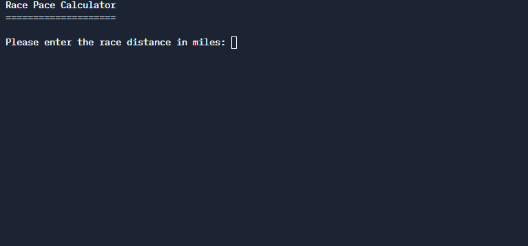

Race Pace Calculator
==========================

You will be creating a running race pace calculator program.  You will ask the user for race distance and race time.  Then calculate their pace per mile.

## Example Program Run

## Program specifications

1. Complete the code in the `Main.java` file.
2. Create 2 **Constants**
	* one for the `number of min in an hour`
	* one for the the `number or seconds in a min`

3. You will **ask the user for a race time** by asking them for the following information in this exact order
    * ask for the **distance of the race in miles**, they can enter decimals
    * ask for the number of `hours` whole number
    * ask for the number of `min` whole number
    * ask for the number of `seconds` whole number

4. Convert those numbers to get the **total race time in seconds**.  **Use the constants you created earlier** in your forumula.

5. Divide the `race time in seconds` by the distance of the race to get the number of seconds per mile.

6. **Round that answer** to the nearest second.

7. **Convert** the seconds per mile to the pace in hours minutes and seconds and print that pace to the user in the format `H:M:S`

## Rubric

* ___/10 Creates Needed Variables and Constants Using Appropriate types and naming conventions
* ___/10 Prompts user for inputs using System.out
* ___/10 Uses the scanner to get input from user
* ___/5 Converts to total seconds
* ___/5 Rounds to the nearest second
* ___/5 Converts to H:M:S
* ___/5 Outputs pace in correct format